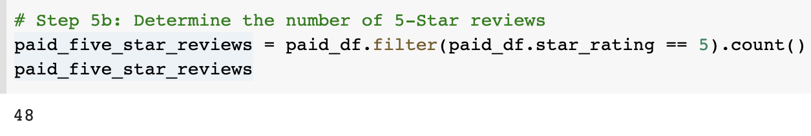

# Amazon_Vine_Analysis

## Project Overview

In this project, we were tasked to analyze Amazon reviews from the the Amazon Vine program. We chose to analyze the video games reviews, using Pyspark, Pandas, and SQL to determine any bias reviews from the Vine members in the dataset.
______
## Resources

Data Sources: Amazon_Reviews_ETL, Vine_Review_Analysis

Software: Google Colaboratory, Visual Studio Code, AWS, Postgres
_____
## Results

There is a couple things we can determine from the dataset:
* How many Vine Reviews and non-Vine reviews are there?

Paid Reviews

Unpaid Reviews

 

After loading the dataset from Amazon, and filtering the most helpful reviews, you can see:

Paid: 
> 94

Unpaid:

>  40471

_____

* How many vine reviews were 5 star? How many non-Vine reviews were 5 stars?

5 Star paid reviews:

> 48

5 star unpaid reviews:

> 15663

_____

* What percentage of Vine reviews were 5 stars? What percentage of non-Vine reviews were 5 stares?

5 Star Vine reviews:

> 51.1%

5 Star Non-vine reviews:

> 38.7%

## Summary:

In total, 51.1% of the 5-Star reviews are paid vine reviews and 38.7% of the 5-star revierws are unpaid vine reviews. The paid reviews are statistically higher and tend to be more favorable because of purchase reliability.

